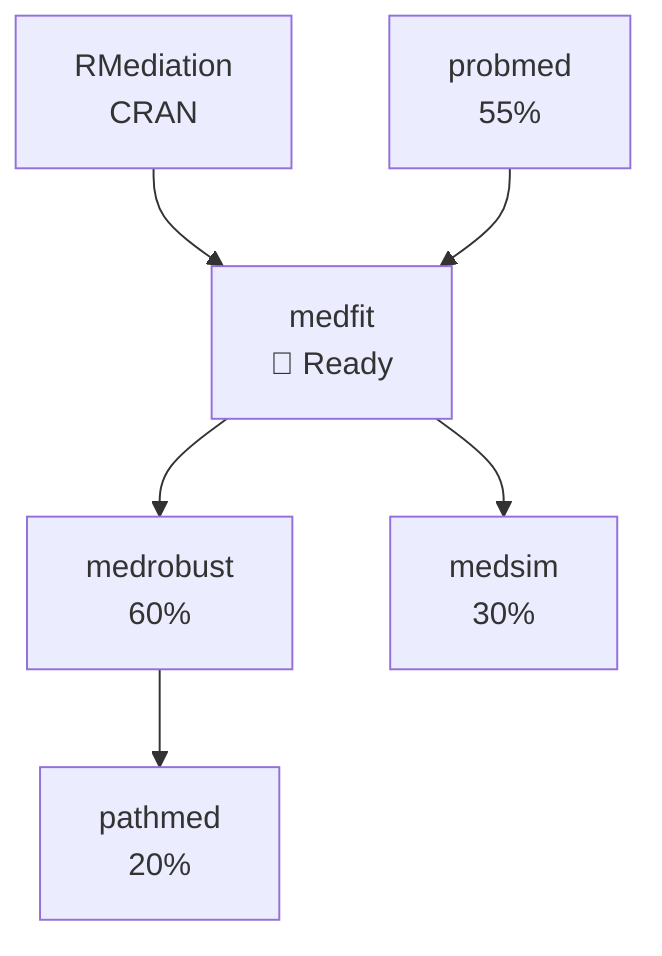

# R Package Development

**Workflow for developing and maintaining R packages**

---

## TL;DR

| Task | Command |
|------|---------|
| Package status | `"Show medfit status"` |
| All packages | `"Mediationverse pulse"` |
| CRAN prep | `"Prep medfit for CRAN"` |
| Document | `"Update medfit documentation"` |

---

## Package Structure in Nexus

```
10-PROJECTS/packages/
├── medfit/
│   ├── _index.md           # Dashboard
│   ├── roadmap.md          # Feature roadmap
│   ├── changelog.md        # Version history
│   └── notes/              # Development notes
├── probmed/
├── medrobust/
├── medsim/
└── pathmed/
```

Each package folder contains **project management** files.
Actual code lives in `~/projects/r-packages/`.

---

## Package Dashboard

Example `_index.md`:

```markdown
# medfit: Causal Mediation Model Fitting

## Status
| Field | Value |
|-------|-------|
| **Version** | 0.9.2 (dev) |
| **CRAN** | Not yet |
| **CI Status** | ✅ Passing |
| **Coverage** | 87% |
| **Progress** | ▓▓▓▓▓▓▓▓▓░ 97% |

## Description
Unified interface for fitting causal mediation models 
with multiple estimators (regression, IPTW, AIPW).

## Next Release: v1.0.0
- [x] Core estimation functions
- [x] Bootstrap CIs
- [x] Multiple mediators support
- [ ] Vignette: Getting Started ← CURRENT
- [ ] CRAN submission

## Active Tasks
- [ ] Write getting started vignette — 3 hrs
- [ ] Add sensitivity analysis wrapper
- [ ] Update README with examples

## Dependencies
- RMediation (CRAN)
- [[probmed]] (dev)

## Links
- GitHub: [Data-Wise/medfit](https://github.com/Data-Wise/medfit)
- Code: `~/projects/r-packages/medfit/`
- pkgdown: [data-wise.github.io/medfit](https://data-wise.github.io/medfit)
```

---

## Mediationverse Overview

### Ecosystem Dashboard

```
"Mediationverse pulse"
```

```
📦 MEDIATIONVERSE ECOSYSTEM

CRAN PACKAGES
  RMediation     ✅ v1.3.0    Downloads: 2,430/mo
    └── Last update: 2026-02-15

RELEASE READY  
  medfit         🚀 v0.9.2    Coverage: 87%
    └── Waiting on vignette

IN DEVELOPMENT
  probmed        ▓▓▓▓▓░░░░░ 55%   v0.5.0-dev
    └── Product distribution methods
    
  medrobust      ▓▓▓▓▓▓░░░░ 60%   v0.4.0-dev
    └── Multiply robust estimation
    
  medsim         ▓▓▓░░░░░░░ 30%   v0.2.0-dev
    └── Simulation framework
    
  pathmed        ▓▓░░░░░░░░ 20%   v0.1.0-dev
    └── Path-specific effects

ECOSYSTEM HEALTH
  CI Status:     5/6 passing (medsim failing)
  Documentation: 4/6 complete
  Test Coverage: Avg 78%
```

### Package Dependencies



---

## Development Workflow

### Feature Development

```
"medfit: Add sensitivity analysis wrapper"
```

Creates task and logs in development notes:

```markdown
## Feature: Sensitivity Analysis Wrapper

### User Story
As a researcher, I want to run sensitivity analysis 
on mediation results without writing boilerplate code.

### Design
- `medfit_sensitivity(model, ...)` function
- Wraps [[sensitivity-analyst]] methods
- Returns tidy tibble

### Tasks
- [ ] Design API
- [ ] Implement core function
- [ ] Add unit tests
- [ ] Document with examples
- [ ] Update vignette

### Notes
- Reference VanderWeele approach
- Consider bootstrap for CIs
```

### Bug Tracking

```
"medfit bug: Bootstrap fails with missing data"
```

Logs issue for resolution.

---

## Documentation Workflow

### Update Docs

```
"Update medfit documentation"
```

Checklist:
```
📝 DOCUMENTATION: medfit

README
- [ ] Installation instructions current
- [ ] Basic example works
- [ ] Badges updated

FUNCTION DOCS (roxygen2)
- [x] medfit() documented
- [x] summary.medfit() documented
- [ ] medfit_sensitivity() ← NEW

VIGNETTES
- [x] Introduction
- [ ] Getting Started ← CURRENT
- [ ] Advanced Topics

PKGDOWN SITE
- [ ] Rebuild after vignette
- [ ] Check all links
```

### Vignette Writing

```
"Write medfit getting started vignette"
```

Claude helps draft with:
- Your mediationverse context
- Consistent notation (VanderWeele style)
- Working code examples

---

## Testing Workflow

### Test Status

```
"medfit test status"
```

```
🧪 TEST STATUS: medfit

Overall: 87% coverage (target: 90%)

By File:
  R/medfit.R          92% ✅
  R/summary.R         88% ✅
  R/bootstrap.R       78% ⚠️
  R/sensitivity.R     — (not tested yet)

Recent Failures: None

Skipped Tests: 3 (require external data)
```

### Before Release

```
"Run medfit release checks"
```

Executes:
- `devtools::check()`
- `R CMD check --as-cran`
- Coverage report
- Spell check
- URL check

---

## CRAN Submission

### Prep for CRAN

```
"Prep medfit for CRAN"
```

```
📦 CRAN SUBMISSION CHECKLIST: medfit

PRE-SUBMISSION
- [x] Version bumped to 1.0.0
- [x] NEWS.md updated
- [x] All tests passing
- [ ] R CMD check: 0 errors, 0 warnings, 0 notes
- [ ] Vignettes build cleanly
- [ ] Examples run < 5s each
- [ ] Description file complete

SUBMISSION
- [ ] Submit via web form
- [ ] Email confirmation received
- [ ] Respond to feedback within 24h

POST-SUBMISSION
- [ ] Tag release on GitHub
- [ ] Update pkgdown site
- [ ] Announce on social/email
```

### Track Submission

```
"medfit submitted to CRAN"
```

Logs submission date, tracks status.

---

## Version Management

### Changelog

Keep `changelog.md` in Nexus project:

```markdown
# medfit Changelog

## [1.0.0] - 2026-06-15

### Added
- Initial CRAN release
- `medfit()` function for causal mediation
- Bootstrap confidence intervals
- Multiple mediator support
- Getting started vignette

### Changed
- N/A (first release)

### Fixed
- N/A (first release)

## [0.9.2] - 2026-06-01

### Added
- Sensitivity analysis wrapper
- Improved error messages

### Fixed
- Bootstrap with missing data (#12)
```

### Version Bump

```
"Bump medfit to 1.0.0"
```

Updates:
- DESCRIPTION
- Changelog
- Project status

---

## Integration with Development

### Code Location

Nexus tracks **project status**.
Code lives separately:

```
~/projects/r-packages/
├── RMediation/     # CRAN package
├── medfit/         # Dev package
├── probmed/
├── medrobust/
├── medsim/
└── pathmed/
```

### Link to Code

In Nexus dashboard:
```markdown
## Code
- Repository: [GitHub](https://github.com/Data-Wise/medfit)
- Local: `~/projects/r-packages/medfit/`
- CI: [Actions](https://github.com/Data-Wise/medfit/actions)
```

### Capture Code Ideas

```
"Capture for medfit: Consider adding tidyverse-style interface"
```

Goes to package notes for future consideration.

---

## Package Commands

| Command | Description |
|---------|-------------|
| `"Show [pkg] status"` | Package dashboard |
| `"Mediationverse pulse"` | All packages |
| `"[pkg]: Add [feature]"` | Log feature |
| `"[pkg] bug: [X]"` | Log bug |
| `"Update [pkg] docs"` | Doc checklist |
| `"Prep [pkg] for CRAN"` | Submission prep |
| `"[pkg] test status"` | Coverage report |
| `"Bump [pkg] to [ver]"` | Version update |

---

## Integration with rforge Skill

Your `/mnt/skills/user/rforge/` (if created) would provide:

- Package scaffolding templates
- Test writing patterns
- Documentation standards
- CI/CD configuration

Example:
```
"Using rforge, scaffold a new function for medfit"
```

---

## Best Practices

### Development
- ✅ Feature branch per change
- ✅ Test before merge
- ✅ Document as you code
- ✅ Log decisions in Nexus

### Documentation
- ✅ README always current
- ✅ Examples that actually run
- ✅ Vignettes for complex features
- ✅ Consistent notation

### Release
- ✅ Changelog updated
- ✅ All checks passing
- ✅ Announce releases
- ✅ Tag in git

---

## Next Steps

- [Research Projects](research-projects.md) — Connect to papers
- [Project Dashboards](../workflows/project-dashboards.md) — General tracking
