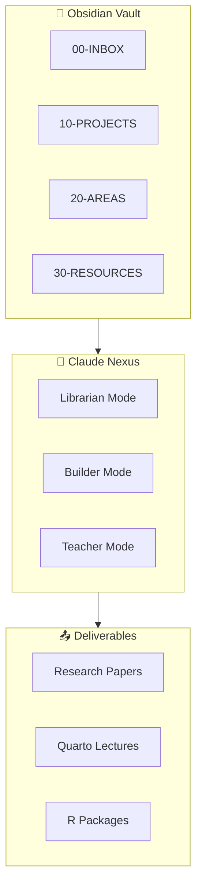

# 🧠 Nexus

# Connect Everything You Know

**Obsidian + Claude Second Brain for Academic Researchers**

[Quick Start](quick-start.md){ .md-button .md-button--primary }
[ADHD Guide](adhd-guide.md){ .md-button }

---

## TL;DR

Nexus turns your **Obsidian vault** into an intelligent knowledge system with **Claude as the cognitive interface**.

| Feature | Description |
|---------|-------------|
| **Knowledge Management** | Semantic search, automatic linking, literature pipeline |
| **Task Management** | Daily focus, project tracking, deadline awareness |
| **Project Dashboards** | Research papers, teaching materials, R packages |
| **Claude Integration** | Natural language queries, proactive suggestions |
| **ADHD Optimized** | Visual anchors, progress tracking, time estimates |

---

## Architecture

---

## Three Modes

-   :material-bookshelf:{ .lg .middle } **Librarian**

    ---

    Knowledge capture, organization, and retrieval

    [:octicons-arrow-right-24: Knowledge workflows](workflows/knowledge-management.md)

-   :material-hammer-wrench:{ .lg .middle } **Builder**

    ---

    Code development and package maintenance

    [:octicons-arrow-right-24: R packages](academic/r-packages.md)

-   :material-school:{ .lg .middle } **Teacher**

    ---

    Lecture creation and course materials

    [:octicons-arrow-right-24: Teaching](academic/teaching-materials.md)

---

## Quick Commands

| Say This | Claude Does |
|----------|-------------|
| `"Morning brief"` | Today's calendar + top 3 tasks + project pulse |
| `"Capture this: [thought]"` | Creates note in inbox |
| `"Show P_med status"` | Project dashboard with progress |
| `"What should I work on?"` | Suggests task based on energy + deadlines |
| `"Create lecture on [topic]"` | Generates Quarto slides |

---

## For Academic Researchers

Nexus is designed for **statistics/biostatistics researchers**:

- 📊 **Research Projects** — Track manuscripts, simulations, reviews
- 🎓 **Teaching Materials** — Generate Quarto lectures, R labs
- 📦 **R Packages** — Manage mediationverse ecosystem
- 📚 **Literature** — Capture papers, extract contributions

---

## ADHD Optimizations

Every response includes:

- ✅ **TL;DR first** (if >200 words)
- ✅ **Time estimates** `[15 min]`
- ✅ **Progress tracking** `[3/7 complete]`
- ✅ **Bold keywords** for scanning
- ✅ **Visual anchors** (tables, bullets)

[:octicons-arrow-right-24: Full ADHD Guide](adhd-guide.md)

---

## Documentation

| Section | Description |
|---------|-------------|
| [Guide](guide/index.md) | Installation & configuration |
| [Workflows](workflows/index.md) | Knowledge, tasks, projects |
| [Reference](reference/index.md) | Commands, templates, queries |
| [Academic](academic/index.md) | Research, teaching, packages |
| [Tutorials](tutorials/index.md) | Step-by-step guides |

---

**Nexus** — Where research, teaching, and code converge.

*Built by Stat-Wise for academic researchers who think in connections.*

