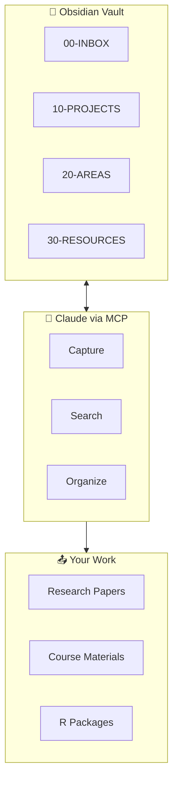

<style>
.md-typeset h1 { display: none; }
.hero { text-align: center; padding: 3rem 1rem; }
.hero img { max-width: 180px; margin-bottom: 1rem; }
.hero h1 { font-size: 2.5rem; margin: 0.5rem 0; border: none; }
.hero p { font-size: 1.2rem; color: var(--md-default-fg-color--light); }
.badges { margin: 1.5rem 0; }
.badges img { margin: 0 0.25rem; }
</style>

<div class="hero" markdown>

# 🧠 Nexus

# Connect Everything You Know

**Obsidian + Claude Second Brain for Academic Researchers**

<div class="badges" markdown>

[](https://data-wise.github.io/nexus/)
[](https://github.com/Data-Wise/nexus/releases)
[](https://github.com/Data-Wise/nexus/blob/main/LICENSE)

</div>

[Quick Start](quick-start.md){ .md-button .md-button--primary }
[ADHD Guide](adhd-guide.md){ .md-button }

</div>

---

## Install in 3 Steps

| Step | Action | Time |
|------|--------|------|
| 1️⃣ | **Obsidian** → Settings → Community Plugins → Search "Nexus" → Install | 2 min |
| 2️⃣ | **Nexus Settings** → Get Started → MCP Integration → Follow wizard | 3 min |
| 3️⃣ | **Claude Desktop**: Paste config, restart, test with `"Show my vault"` | 2 min |

[Full Setup Tutorial →](tutorials/first-day.md)

---

## See It In Action

### Morning Startup

```
You: "Morning brief"

Claude: 🌅 MORNING BRIEF — Tuesday, June 3

📅 TODAY
• 10:00 — STAT 579 Lecture
• 14:00 — Research meeting

🎯 TOP 3 (pick ONE)
1. [45 min] P_med results section
2. [30 min] Grade HW5  
3. [15 min] Process inbox

📊 PROJECT PULSE
• P_med     ▓▓▓▓▓▓▓░░░ 70%
• STAT-579  ▓▓▓▓▓▓▓▓▓░ 93%
```

### Capture Ideas Instantly

```
You: "Capture: VanderWeele's bounds could extend to three-way decomposition"

Claude: ✓ Captured to inbox. Tagged #methodology #sensitivity
```

### Check Project Status

```
You: "Show P_med status"

Claude: 📊 PROJECT: P_med
        Progress: ▓▓▓▓▓▓▓░░░ 70%
        Deadline: June 15 (12 days)
        
        ✅ Introduction, Methods done
        🔄 Results (active)
        ⏳ Discussion, Abstract
        
        Tasks:
        • Add sensitivity table
        • Write results paragraph 3
```

### Add Literature

```
You: "Add paper: Imai 2010 identification for causal mediation"

Claude: ✓ Created literature note in 30-RESOURCES/literature/
        Ready for reading and extraction.
```

---

## Why Nexus?

<div class="grid cards" markdown>

-   :material-brain:{ .lg .middle } **Think in Connections**

    ---

    Your knowledge isn't folders — it's a web. Nexus links ideas across projects, papers, and concepts.

-   :material-lightning-bolt:{ .lg .middle } **Zero Friction Capture**

    ---

    `"Capture: [thought]"` — that's it. No apps to open, no forms to fill. Process later.

-   :material-chart-line:{ .lg .middle } **Progress You Can See**

    ---

    Visual dashboards show exactly where each project stands. No more "what was I working on?"

-   :material-head-heart:{ .lg .middle } **ADHD-Optimized**

    ---

    Time estimates, progress bars, energy matching. Built for brains that work differently.

</div>

---

## Architecture



---

## Quick Commands

| Say This | Claude Does |
|----------|-------------|
| `"Morning brief"` | Today's calendar + top tasks + project status |
| `"Capture: [thought]"` | Creates note in inbox |
| `"Task: [thing]"` | Adds task with due date |
| `"Show [project] status"` | Project dashboard |
| `"Find [topic]"` | Semantic search across vault |
| `"What should I work on?"` | Suggests task based on energy + deadlines |
| `"End of day"` | Wraps up, moves incomplete to tomorrow |

[All Commands →](reference/commands.md)

---

## For Academic Researchers

Nexus is designed for **statistics/biostatistics researchers**:

| Domain | What Nexus Helps With |
|--------|----------------------|
| 📊 **Research** | Track manuscripts, simulations, revisions, submissions |
| 🎓 **Teaching** | Lecture prep, grading queue, office hours notes |
| 📦 **Packages** | R package development, documentation, CRAN prep |
| 📚 **Literature** | Capture papers, extract contributions, link to projects |

[Research Workflows →](academic/research-projects.md) · [Teaching →](academic/teaching-materials.md) · [R Packages →](academic/r-packages.md)

---

## ADHD Optimizations

Every response includes:

| Feature | Why It Helps |
|---------|--------------|
| ✅ **TL;DR first** | Scannable, get the point fast |
| ✅ **Time estimates** `[15 min]` | Combat time blindness |
| ✅ **Progress bars** | Visual feedback, dopamine hit |
| ✅ **ONE task suggestion** | Reduce decision fatigue |
| ✅ **Energy matching** | Right task for your current state |

[Full ADHD Guide →](adhd-guide.md)

---

## Documentation

| Section | What's There |
|---------|-------------|
| [Quick Start](quick-start.md) | 10-minute setup |
| [Tutorials](tutorials/index.md) | Step-by-step guides |
| [Workflows](workflows/index.md) | Knowledge, tasks, projects, literature |
| [Reference](reference/index.md) | Commands, templates, vault structure |
| [Academic](academic/index.md) | Research, teaching, R packages |

---

<div style="text-align: center; padding: 2rem; color: var(--md-default-fg-color--light);" markdown>

**Nexus** uses [ProfSynapse's Nexus plugin](https://github.com/ProfSynapse/nexus) for Obsidian.

*Built by Stat-Wise for academic researchers who think in connections.*

</div>
