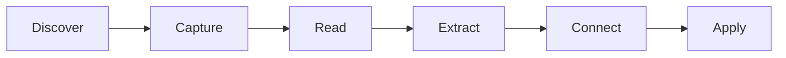

# Literature Pipeline

**⏱️ Read: 10 min | 🎯 Turn papers into actionable knowledge**

---

## TL;DR



| Stage | Command | Output |
|-------|---------|--------|
| Capture | `"Add paper: [citation]"` | Literature note |
| Extract | `"Summarize this paper"` | Key contributions |
| Connect | `"Link to [project]"` | Backlinks |
| Apply | `"How does this apply to P_med?"` | Integration |

---

## Stage 1: Capture

### Quick Capture

```
"Add paper: VanderWeele & Vansteelandt 2014 sensitivity analysis"
```

Claude creates in `30-RESOURCES/literature/`:

```markdown
# VanderWeele & Vansteelandt (2014)

## Citation
VanderWeele, T. J., & Vansteelandt, S. (2014). Sensitivity analysis...

## Status
- [ ] Read
- [ ] Extracted
- [ ] Connected

## Key Contributions
(To be filled after reading)

## Methodology
(To be filled)

## Quotes
(To be filled)

## Implications for My Work
(To be filled)

---
DOI: 10.1097/EDE.0000000000000053
PDF: [[attachments/VanderWeele-2014.pdf]]
Added: 2026-06-03
Tags: #literature #sensitivity-analysis #mediation
```

### From DOI

```
"Add paper from DOI: 10.1097/EDE.0000000000000053"
```

Claude auto-fetches:
- Title, authors, year
- Abstract
- Journal info
- Creates formatted note

### From PDF

When you have a PDF:

```
"Process this paper: [paste abstract or first page]"
```

### Batch Capture

```
"Add these papers to my reading list:
- Smith 2020 causal inference
- Jones 2019 mediation
- Chen 2021 sensitivity"
```

Creates notes for each, adds to reading queue.

---

## Stage 2: Read

### Reading Queue

```
"Show my reading list"
```

```
📚 READING QUEUE (12 papers)

Priority
  1. VanderWeele 2014 — For P_med methods [45 min]
  2. Imai 2010 — Mediation identification [60 min]

This Week
  3. Pearl 2012 — Causal diagrams
  4. Robins 2000 — MSMs

Backlog (8 more)
```

### During Reading

```
"Reading note: VanderWeele 2014 - Key insight about bounds..."
```

Appends to the paper's note with timestamp.

### Reading Completion

```
"Finished reading VanderWeele 2014"
```

Updates status, prompts for extraction.

---

## Stage 3: Extract

### Guided Extraction

```
"Extract key points from VanderWeele 2014"
```

Claude prompts:
1. What's the main contribution?
2. What methodology do they use?
3. What are the key results?
4. What are limitations?
5. How does this relate to your work?

### Quick Extract

```
"VanderWeele 2014 key contribution: Bounds for sensitivity in mediation"
```

### Quote Extraction

```
"Quote from VanderWeele 2014 p.453: 'The bounds provide...' "
```

Adds formatted quote with page reference.

---

## Stage 4: Connect

### Link to Projects

```
"Link VanderWeele 2014 to P_med"
```

Creates bidirectional links:
- Paper note → Project
- Project → Paper note

### Link to Concepts

```
"VanderWeele 2014 relates to sensitivity-analysis and mediation-bounds"
```

### Find Connections

```
"What papers relate to P_med?"
```

Claude searches and suggests:
- Direct citations in project
- Papers with similar tags
- Papers citing same methods

### Citation Network

```
"Show citation network for VanderWeele 2014"
```

Shows:
- Papers it cites (in your vault)
- Papers citing it (in your vault)
- Related by methodology

---

## Stage 5: Apply

### Direct Application

```
"How does VanderWeele 2014 apply to my P_med sensitivity section?"
```

Claude:
1. Reviews paper note
2. Reviews P_med context
3. Suggests specific applications
4. Offers to draft text

### Synthesis

```
"Synthesize sensitivity analysis papers for P_med lit review"
```

Combines multiple papers into coherent summary.

### Gap Analysis

```
"What's missing from my literature on mediation sensitivity?"
```

Identifies gaps based on:
- Your project needs
- Citation patterns
- Missing methodologies

---

## Literature Note Template

```markdown
# {{Author}} ({{Year}}) - {{Title}}

## Citation
{{formatted_citation}}

## Status
- [x] Read
- [x] Extracted  
- [ ] Connected

## Key Contributions
1. {{contribution_1}}
2. {{contribution_2}}

## Methodology
- Approach: {{approach}}
- Data: {{data}}
- Analysis: {{analysis}}

## Key Results
- {{result_1}}
- {{result_2}}

## Quotes
> "{{quote}}" (p. {{page}})

## Limitations
- {{limitation}}

## Implications for My Work
- {{implication}}

---
DOI: {{doi}}
PDF: [[attachments/{{citekey}}.pdf]]
Added: {{date}}
Projects: {{project_links}}
Tags: #literature {{tags}}
```

---

## Search & Discovery

### Find Papers

```
"Find papers about semiparametric mediation"
```

Searches your vault + suggests new papers.

### Similar Papers

```
"Papers similar to VanderWeele 2014"
```

### By Author

```
"Show all VanderWeele papers"
```

### By Tag

```
"Literature tagged sensitivity-analysis"
```

### Recent Additions

```
"Papers added this month"
```

---

## Reading Workflows

### Deep Read (60-90 min)

1. `"Start reading VanderWeele 2014"`
2. Take notes as you go
3. `"Extract key points"`
4. `"Connect to projects"`

### Skim Read (15-20 min)

1. `"Skim VanderWeele 2014"`
2. Claude guides: Abstract → Conclusions → Methods
3. Quick extraction
4. Decision: Deep read later or archive

### Batch Processing

```
"Process reading queue: skim mode"
```

Goes through unread papers, helps triage.

---

## Integration with Zotero

If you use Zotero:

```
"Import from Zotero: sensitivity-analysis collection"
```

Creates notes for each paper with:
- Full citation
- Existing annotations
- PDF links

---

## Commands Reference

| Command | Action |
|---------|--------|
| `"Add paper: [citation]"` | Create literature note |
| `"Add from DOI: [doi]"` | Auto-fetch metadata |
| `"Show reading list"` | View queue |
| `"Extract from [paper]"` | Guided extraction |
| `"Link [paper] to [project]"` | Connect |
| `"Synthesize [topic] papers"` | Combine multiple |
| `"Literature gaps for [project]"` | Find missing |

---

## Best Practices

### Capture
- ✅ Capture immediately when you find relevant paper
- ✅ Include enough info to find it later
- ✅ Tag with methodology and topic
- ❌ Don't read immediately unless urgent

### Extract
- ✅ Extract in your own words
- ✅ Note specific page numbers for quotes
- ✅ Focus on relevance to your work
- ❌ Don't copy-paste entire sections

### Connect
- ✅ Link to all relevant projects
- ✅ Link to related concepts
- ✅ Update project lit reviews
- ❌ Don't silo papers in folders

---

## Next Steps

- [Knowledge Management](knowledge-management.md) — Broader capture system
- [Research Projects](../academic/research-projects.md) — Project integration
